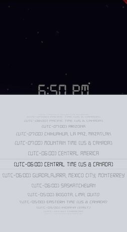

# timely

a [Flutter](https://flutter.dev/) project to help you with time zone confusion submitted as part of Flutter Create 2019.

The size of the code is 5082 kB.

## How to run

Clone this repo: ````git clone git@github.com:tbhbhbh/timely.git````

In the cloned folder, do ````flutter run````

Enjoy!

## Motivation

It's always a struggle for me to catch events in different parts of the world given that I am fan of eSports and Tech events, most of which happen both in North America or Europe. This was made to (kinda) tackle that problem.

## Features

### Quick, easy and convenient



From tapping on the screen, to choosing a timezone, then to getting the time is just 3 simple button presses.

### Ambient background

The background depends on your local time! There will be a day time background for hours between 6 am to 6pm, and a night time background for 6pm to 6am.


### Wide range of timezones

Timezone database was taken from [here](https://github.com/dmfilipenko/timezones.json). Factory methods and JSON parsing were used to parse in this data.


